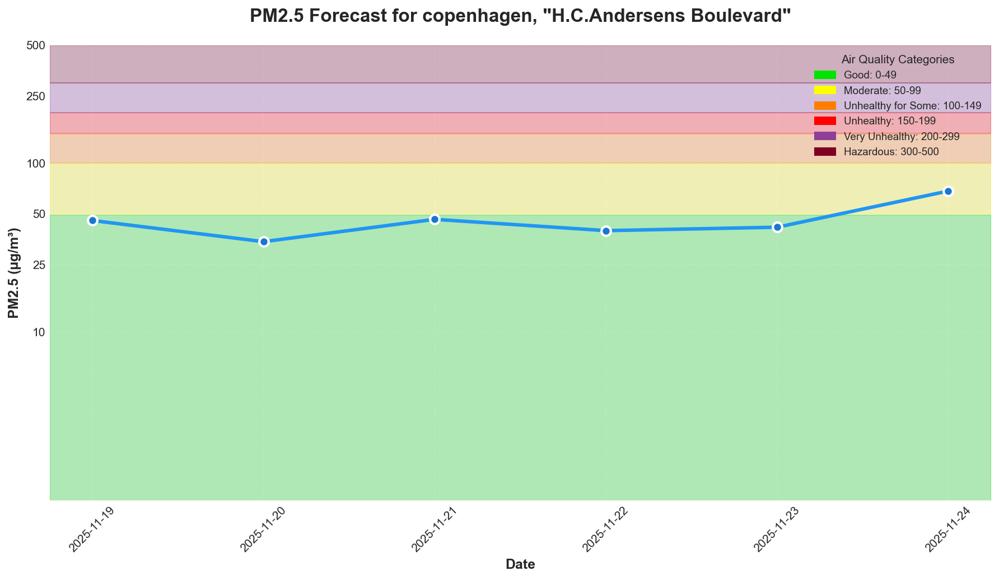
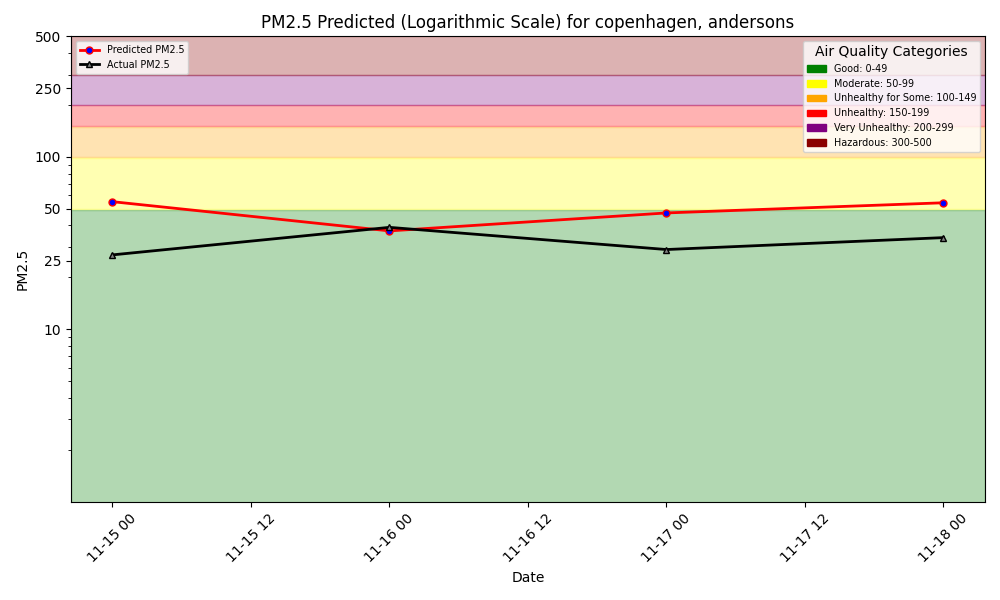

  <h1>Air Quality Forecast</h1>
  
Standard Model

## Air Quality Index (AQI)

  
Good (0-50)

  
Moderate (51-100)

  
Unhealthy for Some (101-150)

  
Unhealthy (151-200)

  
Very Unhealthy (201-300)

  
Hazardous (301+)

---

  <h2>7-Day Forecast</h2>
  
Predicted PM2.5 levels based on weather features.

  
  

    
  

  <h2>Model Performance</h2>
  
Hindcast comparison of predicted vs. actual PM2.5 measurements.

  
  

    
  

---

  
Data: AQICN.org, Open-Meteo.com | Updated daily

